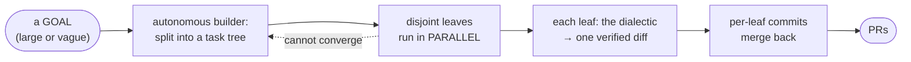

# AI Org Bootstrap Codex

> 🤖 **AI agents:** your operating instructions are in **[AGENTS.md](AGENTS.md)** — read it first.
> This README is the human-facing overview of what the system is and how it works.

<p align="center">
  
</p>

Private Codex-native operating kit for repo work under `mishima-computing`. Not a multi-carrier prompt
pack — the Codex-only build of AI Org Bootstrap: role contracts, Codex adapters, schema-gated handoffs,
deterministic validation, and one merge-gate path.

It is now a **complete autonomous builder**: a GOAL goes in, PRs come out. Three layers stack, each a
deterministic harness wrapped around a semantic (LLM) core:

| Layer | Entry | Unit in → out |
| --- | --- | --- |
| **carrier** | `scripts/carrier_harness.py` | a prompt → one Codex agent run (stdin closed, pinned flags, discipline, timeout + retry, scope enforcement) |
| **dialectic** | `scripts/controller_pipeline.py` | one **objective** → one verified diff (the agent DAG, re-verified outside the carrier, repaired until linon is clean) |
| **autonomous builder** | `scripts/controller_goal.py` | one **goal** → PRs (split into a task tree, build the parts in parallel, recurse on failure, stop at a floor/budget — never a human) |



## The dialectic (one objective → one verified diff)

Codex main is the controller. Specialized Codex agents produce bounded artifacts:

| Agent | Role |
| --- | --- |
| `aggressive-designer` | pressure-tests scope, sequencing, and hidden assumptions |
| `conservative-designer` | preserves repo continuity, CI, dependencies, and rollback paths |
| `genius` | evidence-gated outside insight after local substrate intake |
| `aufheben-designer` | synthesizes design tension into one implementation contract |
| `implementer` | edits only files allowed by the implementation contract |
| `linon` | read-only adversarial CODE verifier (NN1–NN4 + RED tests) before PR |
| `stefan` | read-only aesthetic verifier for human-facing surfaces (design counterpart to Linon) |
| `functional-ci-action-writer` | wires existing functional checks into Actions |
| `security-ci-action-writer` | wires security checks into Actions without secrets or app edits |
| `nonfunctional-ci-action-writer` | wires existing nonfunctional checks into Actions |

The roster is 10 agents. `linon` and `stefan` are the verifier pair: Linon judges code, Stefan judges
design on rendered pixels. Both return findings that drive re-implementation; neither claims adoption.
The designers run as advisory producers (a failed producer does not sink the run if the aufheben still
has a valid input). The controller is a **semantic core** (authoring contracts, synthesizing tension,
judging) that needs an LLM, plus a **mechanical harness** that must be right every time, so it is code.


### Execution: isolated, parallel, grounded

- **org_root / workspace split** — `AI_ORG_ROOT` (or `--org-root`) separates the org install
  (registry / roles / schemas) from the `--repo` workspace, so the org can build an EXTERNAL repo
  (cross-repo), not only itself. Unset, `org_root == repo` (self-hosted, unchanged).
- **per-stage worktree isolation** — every WRITE role runs in its own git worktree detached at HEAD, so
  its scope check evaluates ONLY its own diff (an implementer is never charged for a CI writer's
  `.github` edits), and independent write roles run in PARALLEL; their changes merge back after the wave.
  Read-only producers parallelize the same way.
- **role.md injection** — `codex exec` does not load the `.codex/agents/*.toml` adapter, so each
  carrier's role contract (`roles/*.md`) is injected into its prompt; without it a CI writer would
  implement the feature instead of writing CI.

## The autonomous builder (a goal → PRs)

```sh
python3 scripts/controller_goal.py --repo R --goal "..." [--budget N] [--goal-id ID] [--resume-from ID]
```

**You drive the org by INJECTING a goal — that command IS the unit of operation.** One goal is one
independent process: a goal in, PRs out. The goal can be **large or coarse — you do not pre-decompose it**:
the org recursively SPLITS it into scoped, dependency-ordered sub-tasks (the Splitter-Queue below), builds
the parts in parallel, and splits any part that is still too big — down to an atomic floor (it never asks a
human to break it down). A one-line fix and a sweeping "build me X" enter exactly the same way.
**Inject several at once to run goals in PARALLEL** — each goal is
its own `controller_goal` process, and they all append to the same `STREAM_LOG`, so you observe the
concurrent runs together. (This in-process concurrency is on top of the *in-goal* parallelism below, where
a single goal's disjoint leaves and write roles already run in parallel.) `--budget` bounds a run;
`--goal-id` lets a host track and `--resume-from` resume a goal's state.

`controller_goal.run_goal` is the org's recursive **Splitter-Queue** — the Splitter and the Queue are
one node (`run()` a leaf via the dialectic; `split()` it when it cannot converge):

- `scripts/splitter.py` `split()` decomposes the goal (or a stuck task) into a child task DAG — scoped,
  dependency-ordered, with accumulated house-rules injected — via a read-only Codex carrier, grounded in
  the codebase rather than imagined.
- `scripts/frontier.py` is the recursive task model: `ready_tasks` returns the runnable LEAVES (disjoint
  leaves run in parallel, dependents serialize), a task may hold `children` (a sub-plan), and a node is
  done when all its children are.
- each leaf runs the dialectic in its OWN worktree (the same isolation, one level up); on convergence its
  diff merges back, on a repair-cap failure the leaf SPLITS into children (recursion) — UNLESS it is at
  the FLOOR (atomic scope / max depth), where it fails rather than splitting forever.
- termination is the floor + a token budget, **never a human**: when stuck the org varies strategy or
  grows a new tool, and when the budget is spent it records partial progress and moves on.
- every step appends to a shared event log (`STREAM_LOG`, default `.agent-runs/stream.jsonl`) that a host
  tails for live observability, independent of which worktree a leaf runs in.


Design records (in the host, Shagiri): ADR-0006 the Frontier, ADR-0008 the Splitter, ADR-0009 the stream.

## State (the org owns it)

A goal handed to the org becomes the org's the moment it is received — the org owns its run state; a host
(Shagiri) only READS it (ADR-0007). State is not scattered per-host: it is one shared capability with a
single contract, so every edition inherits it rather than re-implementing it. `scripts/goal_store.py` is the
store — durable, current-state authority, **git-backed**.

- **The work lives in git, not a loose patch.** Each goal's accumulated build is pinned under
  `refs/goals/<id>/{wip,done}` — a commit off the goal's base whose tip is the chain of per-leaf commits
  (`wip` updated as leaves converge, `done` on delivery). Because they are real refs in the object store,
  the work **survives the ephemeral run-worktree's cleanup AND a process/host restart**. The JSON record
  carries the lightweight fields (status, the `queue`/split tree, `leaf_commits`, the per-leaf×role codex
  `sessions`); git carries the heavy content (content-addressed, diffable, free dedup).
- **CLRUD + Find, and Load ≠ Read.** Create / **Load** / **Read** / Update / Delete / find(1→N). *Load* is an
  OPERATION — `load(id)` makes a worktree BECOME that goal's committed state (it cherry-picks the `base..wip`
  range in). *Read* is the safe observation that mutates nothing. They are deliberately distinct: state is
  separated out **because it is operated on**, not merely for completeness.
- **Resume is a first-class operation.** `--resume-from <id>` Loads a prior goal's `wip` into a fresh
  worktree and continues — even a *failed*/floored goal is resumable, because its converged work was already
  saved to `wip`. Resume restores the FILES but **intentionally does NOT restore the frontier**: it re-splits
  the goal fresh, which adapts to a changed goal / codebase / steering and drops a bad earlier plan.
  Restoring a stale frontier would forfeit that; the cost of a fresh re-split — the LLM recreating
  already-built work under new names — is removed two ways instead, keeping the frontier non-restored:
  - the resumed top split **CONTINUES the prior goal's splitter codex session**, so the splitter keeps the
    memory of its original decomposition (the names it chose) and re-plans without amnesiac duplication
    (the same session-reuse the repair loop uses, applied to resume → re-split);
  - and it is fed the **inventory of restored files** ("build on / patch these, do not recreate") as explicit
    ground truth. A declared boundary ("inside `X/` ONLY") is re-applied too, so a resumed plan stays scoped.
- **Repair keeps its memory.** On a Linon-rejection repair iteration the producer designers and the
  implementer RESUME their prior codex session (recorded per leaf×role in state) instead of re-deliberating
  amnesiac — so a repair turn is a small delta on a server-cached session, not a full regeneration. The
  structure (full wave, independent Linon) is unchanged; only the wasted re-writing is gone.
- **Steering is additive and node-targeted.** Guidance injected mid-run (`steer`, via an append-only
  sidecar) folds into the not-yet-dispatched leaves of the `queue` — targeted at the goal or a specific
  Queue node — so you redirect a running build without killing and re-injecting it.
- **The log is the other half.** Every state operation (create/load/save/update/delete) also flows to the
  shared stream as a `{"type":"state", ...}` event: the store is the current-state authority, the log is the
  history/audit. State data belongs on the log (event-sourced); a poor minimal log that drops it is a time
  bomb — the store is never the only copy.

## Mechanical harness

```sh
# launches a carrier with stdin closed (no stdin-wait hang), pinned flags, carrier-discipline
# prepended, a bounded timeout with retry, and post-run scope-deviation enforcement.
python3 scripts/carrier_harness.py run --repo . --sandbox workspace-write \
    --prompt-file <contract> --allowed "demos/**" --timeout 600
python3 scripts/carrier_harness.py --self-test
```

`scripts/carrier_harness.py` owns the single carrier subprocess boundary and enforces
`bootstrap/carrier-discipline.md` and the invocation rules as code (an LLM controller forgets
`< /dev/null`; the harness cannot).

## Package

The installable artifact lives at `packages/codex-org-bootstrap` and exposes:

```sh
aob validate
aob registry check
aob merge-gate <pr> --repo <owner/name> --out .agent-runs/<run>/gates/merge-gate.json
```

For source checkout validation:

```sh
python3 scripts/validate-bootstrap-pack.py
python3 -m unittest discover -s packages/codex-org-bootstrap/tests   # the dialectic harness suite
python3 scripts/test_frontier.py && python3 scripts/test_splitter.py && python3 scripts/test_controller_goal.py
```

## Documentation

- [`AGENTS.md`](AGENTS.md) — the agent operating directive (the bootstrap an AI reads to run in this repo).
- [`docs/architecture.md`](docs/architecture.md) — the system in depth.
- [`docs/decisions/`](docs/decisions/) — Architecture Decision Records (why the engine behaves as it does):
  ADR-0001 Codex-only · ADR-0004 controller-python-ification · ADR-0005 settledness-not-dumbing ·
  ADR-0007 the org owns its state · ADR-0008 floor-is-not-failure (recovery + deterministic scaffold).
- [`docs/codex-carrier-capabilities.md`](docs/codex-carrier-capabilities.md) — what the Codex carrier can and cannot do.
- [`docs/evidence/`](docs/evidence/) — measured results (role timing & pipelining, cone-recall).

## Source of truth

- `registry/runtime-registry.yaml`: role, adapter, schema, write scope, and output target map.
- `roles/*.md`: human-readable role contracts (injected into each carrier prompt).
- `.codex/agents/*.toml`: Codex adapter instructions.
- `schemas/*.json`: handoff and report validity.
- `scripts/controller_pipeline.py`: the dialectic DAG runner (waves, per-stage worktree isolation, repair loop).
- `scripts/controller_goal.py`, `scripts/frontier.py`, `scripts/splitter.py`: the autonomous builder (goal → split → parallel build → deliver), the recursive task model, and `split()`.
- `scripts/carrier_harness.py`: deterministic carrier launcher + scope enforcement.
- `scripts/merge-gate.py`: sole merge path.
- `scripts/verify-linon-packet.py`, `scripts/stefan-aesthetic-review.py`, `scripts/measure-result-screen.py`: verifier instruments (code / aesthetics / rendered-pixel measurement).
- `packages/codex-org-bootstrap`: importable deterministic runtime.

## Hard boundary

This repository is **Codex-only**: it must not contain non-Codex carrier directories, invocation
procedures, adapters, or fallback instructions. The agent-facing form of this rule — and the rest of the
operating directive — is in [AGENTS.md](AGENTS.md).
