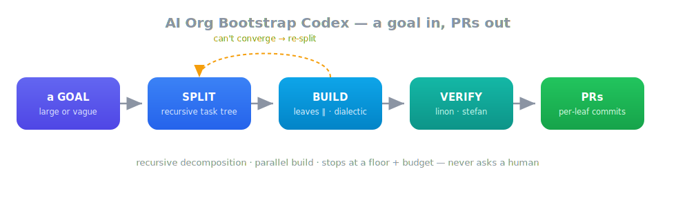
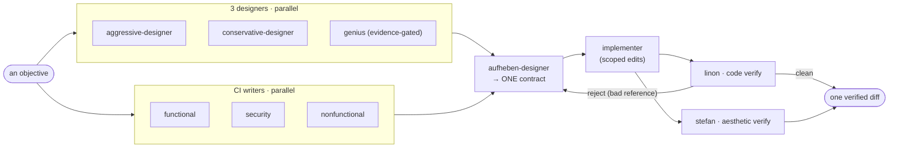

# AI Org Bootstrap Codex

> 🤖 **AI agents:** your operating instructions are in **[AGENTS.md](AGENTS.md)** — read it first.
> This README is the human-facing overview of what the system is and how it works.

<p align="center">
  
</p>

Private Codex-native operating kit for repo work under `mishima-computing`. Not a multi-carrier prompt
pack — the Codex-only build of AI Org Bootstrap: role contracts, Codex adapters, schema-gated handoffs,
deterministic validation, and one merge-gate path.

## Usage

Use the canonical procedure in [bootstrap/codex-bootstrap.md](bootstrap/codex-bootstrap.md) when starting a
run. At the human boundary, confirm the objective, target repo, target branch readiness, and non-goals first;
write the goal as an observable outcome with acceptance boundaries, not as a manually decomposed task list.

```sh
python3 scripts/controller_goal.py --repo <repo> --goal "..."
```

Optional run controls are `--budget`, `--goal-id`, and `--resume-from`. Use a goal id when you want a stable
handle for deliberate resume or steering across runs.

Observe progress through `STREAM_LOG` or its default path, `.agent-runs/stream.jsonl`. The stream is runtime
history for watching and auditing a run; it is not committed output. Review the produced PR outputs before
validation, delivery, or merge; complete the checks requested by the run, then merge only through
`aob merge-gate` or `scripts/merge-gate.py`.

It is now a **complete autonomous builder**: a GOAL goes in, PRs come out. Three layers stack, each a
deterministic harness wrapped around a semantic (LLM) core:

| Layer | Entry | Unit in → out |
| --- | --- | --- |
| **carrier** | `scripts/carrier_harness.py` | a prompt → one Codex agent run (stdin closed, pinned flags, discipline, timeout + retry, scope enforcement) |
| **dialectic** | `scripts/controller_pipeline.py` | one **objective** → one verified diff (the agent DAG, re-verified outside the carrier, repaired until linon is clean) |
| **autonomous builder** | `scripts/controller_goal.py` | one **goal** → PRs (split into a task tree, build the parts in parallel, recurse on failure, stop at a floor/budget — never a human) |


## What this is: an autonomous SDLC engine (not a coding agent)

A normal coding agent imitates a *good developer*. This imitates a *software **organization*** — developer,
designer, QA, security, change-management, and an audit trail — built into the machine, so the model's good
intentions are **never** the safety mechanism. Authority-per-role, schema-gated hand-offs, worktree
isolation, scope enforcement, a single merge path, independent review, and a hard repair cap all live on the
**deterministic** side. The difference is not a smarter author, but the organisational controls that would
normally surround one.

It is a **headless engine** by design — CLI, JSON-lines, and Git are the only boundary; Codex-only; no human
is pulled into decomposition or repair. These are deliberate, not limitations: a stable machine boundary is
what makes the engine drivable by automation and its runs reproducible and auditable.

**Status (external review):** an **enforcement-capable autonomous SDLC engine — enterprise-*qualifiable*, not
yet enterprise-*ready*.** The verification gates (below) *close the loop* — they re-run every repair, gate the
contract *before* implementation, and fail closed on a gate error — so configured to `block` the engine
actually **enforces**, it does not merely observe. What remains for unsupervised enterprise production is
**not more agents or prompts**, but: a typed **goal dossier** as the engine's input contract (business intent
→ structured input, with irreversible / high-risk items resolved before any code is written); a **signed,
non-bypassable policy bundle** (which gates are `block`, which carriers and sandbox are allowed — its digest
bound into the run so it cannot be weakened mid-run or by a generating agent); an **isolated execution runtime
as a mandatory boundary** (no silent fallback to a local subprocess in enterprise mode); **per-deliverable /
per-app-kind profiles** (HTTP / database / authorization / operability, not only CLI); **gate evidence
cryptographically bound to the artifact + policy hashes** (in-toto / SLSA-style provenance: *this gate passed
for this contract, this artifact, this policy, this isolated environment*); and **continuous evaluation on
real, ambiguous requirements** — not just precise developer-written goals.

The claim this earns is not "AI builds apps" but: **evidence-bearing, enterprise-grade software production for
people who do not have a controlled software organisation.**

## The dialectic (one objective → one verified diff)

Codex main is the controller. Specialized Codex agents produce bounded artifacts:

| Agent | Role |
| --- | --- |
| `aggressive-designer` | pressure-tests scope, sequencing, and hidden assumptions |
| `conservative-designer` | preserves repo continuity, CI, dependencies, and rollback paths |
| `genius` | evidence-gated outside insight after local substrate intake |
| `aufheben-designer` | synthesizes design tension into one implementation contract |
| `implementer` | edits only files allowed by the implementation contract |
| `linon` | read-only adversarial CODE verifier (NN1–NN4 + RED tests) before PR |
| `stefan` | read-only aesthetic verifier for human-facing surfaces (design counterpart to Linon) |
| `functional-ci-action-writer` | wires existing functional checks into Actions |
| `security-ci-action-writer` | wires security checks into Actions without secrets or app edits |
| `nonfunctional-ci-action-writer` | wires existing nonfunctional checks into Actions |

The roster is 10 agents. `linon` and `stefan` are the verifier pair: Linon judges code, Stefan judges
design on rendered pixels. Both return findings that drive re-implementation; neither claims adoption.
The designers run as advisory producers (a failed producer does not sink the run if the aufheben still
has a valid input). The controller is a **semantic core** (authoring contracts, synthesizing tension,
judging) that needs an LLM, plus a **mechanical harness** that must be right every time, so it is code.



### Execution: isolated, parallel, grounded

- **org_root / workspace split** — `AI_ORG_ROOT` (or `--org-root`) separates the org install
  (registry / roles / schemas) from the `--repo` workspace, so the org can build an EXTERNAL repo
  (cross-repo), not only itself. Unset, `org_root == repo` (self-hosted, unchanged).
- **per-stage worktree isolation** — every WRITE role runs in its own git worktree detached at HEAD, so
  its scope check evaluates ONLY its own diff (an implementer is never charged for a CI writer's
  `.github` edits), and independent write roles run in PARALLEL; their changes merge back after the wave.
  Read-only producers parallelize the same way.
- **role.md injection** — `codex exec` does not load the `.codex/agents/*.toml` adapter, so each
  carrier's role contract (`roles/*.md`) is injected into its prompt; without it a CI writer would
  implement the feature instead of writing CI.

## The autonomous builder (a goal → PRs)

```sh
python3 scripts/controller_goal.py --repo R --goal "..." [--budget N] [--goal-id ID] [--resume-from ID]
```

**You drive the org by INJECTING a goal — that command IS the unit of operation.** One goal is one
independent process: a goal in, PRs out. The goal can be **large or coarse — you do not pre-decompose it**:
the org recursively SPLITS it into scoped, dependency-ordered sub-tasks (the Splitter-Queue below), builds
the parts in parallel, and splits any part that is still too big — down to an atomic floor (it never asks a
human to break it down). A one-line fix and a sweeping "build me X" enter exactly the same way.
**Inject several at once to run goals in PARALLEL** — each goal is
its own `controller_goal` process, and they all append to the same `STREAM_LOG`, so you observe the
concurrent runs together. (This in-process concurrency is on top of the *in-goal* parallelism below, where
a single goal's disjoint leaves and write roles already run in parallel.) `--budget` bounds a run;
`--goal-id` tracks a goal's state across runs and `--resume-from` resumes it.

`controller_goal.run_goal` is the org's recursive **Splitter-Queue** — the Splitter and the Queue are
one node (`run()` a leaf via the dialectic; `split()` it when it cannot converge):

- `scripts/splitter.py` `split()` decomposes the goal (or a stuck task) into a child task DAG — scoped,
  dependency-ordered, with accumulated house-rules injected — via a read-only Codex carrier, grounded in
  the codebase rather than imagined.
- `scripts/frontier.py` is the recursive task model: `ready_tasks` returns the runnable LEAVES (disjoint
  leaves run in parallel, dependents serialize), a task may hold `children` (a sub-plan), and a node is
  done when all its children are.
- each leaf runs the dialectic in its OWN worktree (the same isolation, one level up); on convergence its
  diff merges back, on a repair-cap failure the leaf SPLITS into children (recursion) — UNLESS it is at
  the FLOOR (atomic scope / max depth), where it fails rather than splitting forever.
- a leaf that is **underdetermined** — its falsifiable acceptance (outcome / success condition / negative
  control) cannot be named (ADR-0016 D1b) — is NOT split (decomposing an undefined unit only multiplies the
  undefinedness): the org instead **asks for the missing information and parks that leaf** (`blocked_hitl`)
  while its independent siblings keep building, and a supplied answer reaches the parked leaf's refine on
  resume. Before asking bare, it first SEARCHES the repo's own ADRs for the already-decided answer and asks
  you to CONFIRM it ("found THIS — right?"), listing conflicts side-by-side rather than guessing.
- termination is the floor + a token budget — the org never asks a human to *decompose* or to keep going;
  the one thing it asks for is missing *information* (above), and even then only that leaf waits while the
  rest of the run continues. When stuck it varies strategy or grows a new tool; when the budget is spent it
  records partial progress and moves on.
- every step appends to a shared event log (`STREAM_LOG`, default `.agent-runs/stream.jsonl`) that can be
  tailed for live observability, independent of which worktree a leaf runs in.


## State (the org owns it)

A goal handed to the org becomes the org's the moment it is received — the org owns its run state and is its
sole authority; everything else only READS it (ADR-0007). State is not scattered per-run: it is one shared
capability with a single contract, so every edition inherits it rather than re-implementing it.
`scripts/goal_store.py` is the store — durable, current-state authority, **git-backed**.

- **The work lives in git, not a loose patch.** Each goal's accumulated build is pinned under
  `refs/goals/<id>/{wip,done}` — a commit off the goal's base whose tip is the chain of per-leaf commits
  (`wip` updated as leaves converge, `done` on delivery). Because they are real refs in the object store,
  the work **survives the ephemeral run-worktree's cleanup AND a process restart**. The JSON record
  carries the lightweight fields (status, the `queue`/split tree, `leaf_commits`, the per-leaf×role codex
  `sessions`); git carries the heavy content (content-addressed, diffable, free dedup).
- **CLRUD + Find, and Load ≠ Read.** Create / **Load** / **Read** / Update / Delete / find(1→N). *Load* is an
  OPERATION — `load(id)` makes a worktree BECOME that goal's committed state (it cherry-picks the `base..wip`
  range in). *Read* is the safe observation that mutates nothing. They are deliberately distinct: state is
  separated out **because it is operated on**, not merely for completeness.
- **Resume is a first-class operation.** `--resume-from <id>` Loads a prior goal's `wip` into a fresh
  worktree and continues — even a *failed*/floored goal is resumable, because its converged work was already
  saved to `wip`. Resume restores the FILES but **intentionally does NOT restore the frontier**: it re-splits
  the goal fresh, which adapts to a changed goal / codebase / steering and drops a bad earlier plan.
  Restoring a stale frontier would forfeit that; the cost of a fresh re-split — the LLM recreating
  already-built work under new names — is removed two ways instead, keeping the frontier non-restored:
  - the resumed top split **CONTINUES the prior goal's splitter codex session**, so the splitter keeps the
    memory of its original decomposition (the names it chose) and re-plans without amnesiac duplication
    (the same session-reuse the repair loop uses, applied to resume → re-split);
  - and it is fed the **inventory of restored files** ("build on / patch these, do not recreate") as explicit
    ground truth. A declared boundary ("inside `X/` ONLY") is re-applied too, so a resumed plan stays scoped.
- **Repair keeps its memory.** On a Linon-rejection repair iteration the producer designers and the
  implementer RESUME their prior codex session (recorded per leaf×role in state) instead of re-deliberating
  amnesiac — so a repair turn is a small delta on a server-cached session, not a full regeneration. The
  structure (full wave, independent Linon) is unchanged; only the wasted re-writing is gone.
- **Contract-level findings get a deterministic patch, not a re-synthesis.** A contract-preflight finding
  whose fix target is fully determined by its structured detail — a missing conformance profile, an
  over-broad forbidden glob that swallows an allowed deliverable, a `deliverable_kind` implied by a sole
  profile — is resolved by `scripts/contract_patch.py`: a targeted, LLM-free edit to just that field, instead
  of re-running aufheben to re-synthesize the whole contract (which drifts unrelated fields). The patch is
  confirmed by re-running contract-preflight (unproven never passes); a finding that is judgment
  (`acceptance_criteria`, an ambiguous kind) escalates to re-synthesis. The audit delta is returned
  *separately* and persisted to provenance, so the patched contract stays schema-valid. ADR-0013.
- **Steering is additive and node-targeted.** Guidance injected mid-run (`steer`, via an append-only
  sidecar) folds into the not-yet-dispatched leaves of the `queue` — targeted at the goal or a specific
  Queue node — so you redirect a running build without killing and re-injecting it.
- **The log is the other half.** Every state operation (create/load/save/update/delete) also flows to the
  shared stream as a `{"type":"state", ...}` event: the store is the current-state authority, the log is the
  history/audit. State data belongs on the log (event-sourced); a poor minimal log that drops it is a time
  bomb — the store is never the only copy.

## The Border Collie (an anti-pattern immune system)

`scripts/border_collie.py` is a high-layer, **independent** patroller — a *pack* of cheap anti-pattern
smell-detectors that runs ALONGSIDE the builder, never inside its loop. It tails the shared event log
read-only, SNIFFS the heuristic signature of a known failure mode (a self-declared-minimal node re-split
forever; a branch churning without landing; gold-plating a prerequisite while the goal's named deliverable is
never touched; re-implementing existing logic in another language; an ADR that claims a gate with no code), and
BARKS an **advisory** steer at the drifting node — folded at that node's next dispatch, never a kill. The
catalog GROWS as new failure modes are diagnosed, and is sharded across N dogs (`--scents`, `--instance i/N`)
so it scales by adding dogs, not weight. Barking follows neural **habituation** (an adaptive firing threshold):
a dog tires of the same smell and quiets, recovers over time, and escalates on a smell that persists or
intensifies — so it warns without becoming noise. This is capability in the MECHANISM, not in hoping a smart
model never errs: the knowledge of how autonomous builders fail lives in one patroller's catalog, not as
special-cases scattered through the decomposition logic.

## Mechanical harness

```sh
# launches a carrier with stdin closed (no stdin-wait hang), pinned flags, carrier-discipline
# prepended, a bounded timeout with retry, and post-run scope-deviation enforcement.
python3 scripts/carrier_harness.py run --repo . --sandbox workspace-write \
    --prompt-file <contract> --allowed "demos/**" --timeout 600
python3 scripts/carrier_harness.py --self-test
```

`scripts/carrier_harness.py` owns the single carrier subprocess boundary and enforces
`bootstrap/carrier-discipline.md` and the invocation rules as code (an LLM controller forgets
`< /dev/null`; the harness cannot).

## Deterministic where decidable, model where irreducible

The org is built on a sharp split: everything **decidable** — isolation, durability, capture, revert,
who-touched-what — is done with **git (and codex's own features), LLM-free**; only the **irreducible**
work — decomposing a goal, designing, writing, judging — is done by the **model**. Prompts that *steer*
the model sit between, but they are **backed by deterministic enforcement**, never trusted alone.

- **Deterministic backbone (git + codex, the trusted layer).** Isolation: `git worktree add --detach`
  per leaf/goal. State & resume: work pinned under `refs/goals/<id>/{wip,done}`, restored by
  `merge-base` + `cherry-pick base..wip`. Per-leaf commit: `git_ops.merge_and_commit_leaf`. Scope:
  `git status --porcelain -uall` to see every change (incl. untracked), `git checkout`/`reset` to revert
  out-of-scope or cross-lane strays, `git apply` to resume a patch. Capture: `git diff` plus
  `git diff --no-index` so new files appear as real diffs without touching the index. Carrier memory:
  codex `resume` of a captured `thread.started` session (repair and resume re-use it). And the LLM-free
  scaffold primitive.
- **Irreducible model (prompt = judgment / creation).** The splitter (decompose), the dialectic
  (`aggressive` / `conservative` / `genius` / `aufheben`), the `implementer` (write the code/prose), and
  the `linon` / `stefan` reviewers. There is no deterministic substitute here — and forcing one would be
  *dumbing*, not settling.
- **Prompt-steer + git-enforce (the hybrids).** `bootstrap/carrier-discipline.md` and the role specs;
  the `scope_boundary` that steers the splitter to a declared directory; the `resumed_prior_work`
  inventory that keeps a re-split idempotent. Soft guidance, made safe by the deterministic layer above.

**The seam is where bugs live: a job that *could* be deterministic, left to a prompt.** Three were moved
prompt → deterministic recently — scaffold base (a leading-verb guess → `_declared_dir` extraction), the
cross-lane `.github` revert (relying on the design contract to list it → registry-derived), and the
new-file diff (a "don't run git" rule → `git diff --no-index`). Known seams still leaning on a prompt,
to harden over time: the declared **`scope_boundary` is steer-only** (prevention; there is no
deterministic clamp of a deliverable role's effective allow-set to the goal boundary yet — drift relies
on the steer); and the implementer's "never edit `.github`" line is now belt-and-suspenders behind the
cross-lane revert (the prompt could eventually go).

## Verifying the model's work: an executable contract + deterministic gates (ADR-0009)

The same split, applied to **verification**. The dividing line is not "binary defect vs contextual defect";
it is: **choosing** the contract/policy is judgment, **checking and enforcing** the chosen contract is
deterministic. So the design agents emit an *executable* contract and deterministic gates prove the build
obeys it — **"B produces an executable A."** This corrects an earlier review that was almost entirely *static* —
it read and reasoned over the code but never independently **ran** it (the implementer self-reports its tests) —
by adding a *dynamic* tier that executes the artifact. Every gate is wired **shadow-first**: it streams its findings but blocks nothing until its effective
false-positive rate is shown ~0, then a one-line flip promotes it to `block`; findings route through the same
severity budget / repair loop as Linon's.

**The review half is an unanchored adversary — and stays that way.** The deterministic gates above are the
*enforcement* half; `linon` is the *judgment* half, and the two are kept deliberately apart. **Linon is not
given the goal or the implementation contract.** That is not an oversight: a reviewer told what a change is
*supposed* to do tends to confirm that intent and stop smelling the things no one framed — the broken caller in
an *unchanged* file, the resource leak the contract never mentioned, the edge case outside the spec. Its value
is precisely the *unframed* find, so it reviews the change cold. "Does the artifact satisfy the goal/contract?"
is a different question, and it is answered better *deterministically* — by the conformance gate (golden
examples the implementer never saw) and the pre-implementation contract review — than by dulling the adversary's
nose. The improvement axis that follows is the important one: when first-pass review fails (it does ~55% of the
time), the fix is to make the **designers and implementers** good enough to satisfy an independent adversary —
never to anchor the adversary to make itself easier to pass.

**How Linon reads — `codex review`'s scope behaviour (verified, not assumed).** Linon runs through Codex's
native `codex review` (`scripts/codex_review.py`), whose reading scope was probed directly:

- **The diff is an *anchor*, not a read-limit.** It starts from the change set (`--uncommitted`: staged +
  unstaged + untracked, or `--base <branch>`) but reads the **full changed files, their base version, and the
  unchanged dependents** to judge cross-file impact. In a controlled test it caught a signature change in
  `lib.py` by reading the *unchanged* `caller.py` and naming the exact `TypeError` the existing call would
  raise — a defect a bare-diff reviewer structurally cannot see.
- **No hard read boundary.** Relevance is the model's call; it will also open noise (lockfiles, caches, even
  its own log) and then correctly drop it from the findings. What it does *not* audit is code unrelated to the
  change (the anchor keeps it from auditing the whole tree unprompted) and anything git does not surface as
  changed (ignored/excluded paths are never in the change set, so they are never a starting point).
- **Output is semi-structured and parseable:** `- [P<n>] <title> — <file>:<line>` plus an indented body
  (`P1` blocking, `P2` major, `P3` minor). `codex_review.py` parses this into the same finding shape the repair
  loop already consumes, so the reviewer is a drop-in for the role with no bespoke protocol.

**The loop is closed (in `block`).** An external static review found the first cut was quality *telemetry*,
not enforcement: gate findings folded into convergence **once**, then the repair loop recomputed findings from
Linon alone and never re-ran the gates — so a `block` violation could vanish the moment Linon went clean. Two
fixes close it. (1) **The artifact gates re-run every repair iteration** and feed their findings to the repair
agents, so convergence requires Linon clean **and** every `block` gate clean *on the current artifact*, not a
stale initial result. (2) **Pre-flight is a true pre-implementation gate**: in `block`, a contract defect
re-runs *only* aufheben (fed the findings), up to a cap, and fails closed on a persistent defect — a bad
contract costs an aufheben re-run, not a wasted implementer + reviewer wave. In `shadow` (the default) both
are pure observation, so this is a no-op until a gate is promoted — but promotion now buys real enforcement.

Gates in place (each `ENV` selects `shadow` (default) | `off` | `block`):

| Gate | What it does | Env |
|---|---|---|
| **Conformance** (`scripts/conformance.py`) | runs the built artifact against the contract's declared interface, per `deliverable_kind` — **cli** (run examples, check exit status + stdout/stderr), **http_service** (boot + request/response), **library** (import-probe the declared public surface), **batch_job** (run the job, check exit status + produced artifacts), **json** (parse + JSON-Schema + key paths, no execution), **rpc_service** (boot + real call/response; gRPC loaded lazily). `deliverable_kind` is **required**; `none` = no interface, `undetermined` = an interface of a kind no checker supports yet (streamed as unchecked, never a silent pass) | `CONFORMANCE_GATE` |
| **Contract pre-flight** (`scripts/contract_preflight.py`) | the moment aufheben emits the contract and *before* the implementer runs, checks completeness + exit-code consistency, so an under-specified contract is caught at design time | `CONTRACT_PREFLIGHT` |
| **Immutable acceptance bundle** (`controller_pipeline._withhold_acceptance_bundle`) | withholds the golden examples from the implementer — it builds to the spec, the gate checks goldens it never saw, so the implementation and its oracle cannot share one misunderstanding | `WITHHOLD_ACCEPTANCE_BUNDLE` |
| **Secret scan** (`scripts/secret_scan.py`) | scans source **and the built artifact's archives** via gitleaks (with a pure-Python fallback); known provider tokens / private keys block, generic entropy is advisory, and the secret value is never emitted into a finding | `SECRET_SCAN` |
| **CLI fuzz** (`scripts/fuzz_cli.py`) | black-box property fuzzing of the built CLI: generates adversarial inputs (empty / malformed / oversized / binary / unicode) and searches for an input that **crashes** it, exits **outside the declared code policy**, or **hangs** — reporting a *minimized* counterexample | `FUZZ_CLI` |
| **Resource limits** | the conformance/fuzz subprocess runner is rlimit/timeout/output-bounded (the executes-untrusted-artifact boundary; an isolated execution backend is the mandatory one in enterprise mode) | — |

**Finding → regression (`scripts/regression_corpus.py`).** Every accepted finding must become a
deterministic re-check, or the org re-pays LLM cost to re-discover it. The deterministic gates above
*self-regress* by construction — conformance re-checks the contract's examples, secret-scan re-scans,
pre-flight re-validates — every leaf. The one gate that does **not** is fuzzing (its inputs are stochastic),
so its counterexamples are persisted to a corpus and **replayed first** on every later run: a fixed crash
that reappears is caught instantly and deterministically, not rediscovered by random luck or an LLM.

End to end the spine is **choose → encode → check → contain → fuzz → regress**: judgment chooses the
contract, deterministic gates do the rest.

**Proven end to end (live):** an *unchanged* org, given a CLI goal, emitted a `conformance.cli` profile (exit
codes pinned, six examples covering `--help` / success / error), built a contract-honouring CLI, and the
conformance gate **ran the artifact** and passed all six examples — verification by *running*, not by
self-report. (The gates are also exercised by ~50 unit tests across the suites listed above.)

**Deferred, with reason** (so this section is not read as "everything is done"):

- **SAST tiering and sanitizers** wait on an engine (Semgrep / CodeQL / a sanitizer) shipped in the box
  image — a *blocking* rule needs ~0 effective false positives, which cannot be measured without the engine,
  so a home-grown regex "SAST" is not built.
- **The inner build sandbox's network default-deny / read-only-root** belong to the *inner* sandbox that runs
  the built app's tests, not the carrier's outer box (which needs LLM egress and a writable fs).
- **An independent *LLM* review of contract-vs-goal** ("is this the right interface?") is the *judgment* half
  of pre-implementation review; it overlaps the designers and is added only if telemetry shows
  contract-vs-goal misses the deterministic pre-flight does not.
- **Promotion from `shadow` to `block`** happens per gate only once its effective-FP is shown ~0 on real
  runs. ADR-0009 investments #1–#4 are built; the remainder is telemetry-, engine-, or demand-gated.
- **Open P0/major from the external review** (beyond the closed loop + pre-flight gate already landed):
  `GateResult{status, contract_sha, artifact_sha}` with **fail-closed on a gate ERROR** (a scanner crash is
  currently treated as clean — a silent fail-open); **execution isolation** of the artifact runner
  (argv-not-shell, network default-deny, cgroups — the inner-sandbox boundary); **leaf-scoped** (not
  repo-wide) secret scanning with a baseline. Tracked, in that rough priority. (Landed since: every
  `deliverable_kind` now has a real checker — library / http_service / rpc_service / batch_job / json — and
  the kind is schema-required; targeted repair routing by finding source; the Draft 2020-12 validator with
  `jsonschema` declared as a dependency.)

Honest status: with the closed loop and the pre-flight gate, the gates are **enforcement-capable** in
`block`, but most ship in `shadow` by default and the isolation/ERROR-handling items above are real. This is
a deterministic verification spine that is *closing* on a quality-assurance system, not yet a finished one.

The full defect-class allocation, repair routing, and the five-step investment sequence are in **ADR-0009**;
its one-line boundary: *the model/human decides what must be true and whether the contract fits the goal;
deterministic systems prove, test, or enforce that the implementation obeys it.*

**Grounding** — these gates follow a web-research synthesis recorded in ADR-0009, so the reasons and sources
are traceable:

- **Google Tricorder** — build-breaking analyses needed ~**0** effective false positives, review-time stayed
  **<10%**: the basis for *shadow-first, promote to blocking only at ~0 FP*.
- **oasdiff** — separates *definite* from *potential* breaking changes: the model for tiered-confidence gates
  (never hard-block on a guess).
- **OSS-Fuzz** (May 2025) — >**13,000** vulnerabilities / **50,000** bugs across ~1,000 projects: the case for
  fuzzing parsers/codecs — the basis for the CLI-fuzz gate (a black-box generator; in-process Hypothesis and
  coverage-guided Atheris are deeper backends for a future box image).
- **Amazon ShardStore** — an executable reference model + property testing prevented **16** production issues
  at ~13% of codebase size and ~9 person-months: evidence for *selective*, not universal, formal modelling.
- **TypeScript/Flow repository-mining study** — caught ~**15%** of sampled public JS bugs: types-as-contracts
  are *one* layer, not a behavioural spec.
- **GitHub secret scanning / push-protection** — block known-format tokens *before* they enter the repo,
  validity-check only where confident: the validity-tiered secret gate (provider token blocks, generic
  advises).
- **Secret-leak longitudinal study** — >**100,000** public repos affected, thousands of new secrets/day:
  prevention beats review-only detection; a real hit must be rotated/revoked, not just deleted.
- **Linux cgroup v2** / **OWASP fail-secure** — deterministic memory/cpu ceilings, and security controls that
  default to deny: the box resource limits and securityContext.

## Lineage: the convergence of pre-LLM coding automation

The architecture is not novel in its parts. It is the convergence of decades of work on the one question every
pre-LLM automation system fought — how to get reliable output from an unreliable generator — and each
structural choice traces to a precedent that earned it and a failure that shaped it.

- **The oracle carries the reliability, not the generator.** Counterexample-guided inductive synthesis
  (Solar-Lezama et al., *Combinatorial Sketching for Finite Programs*, 2006) showed that a weak — even random —
  generator converges on a correct program when the **verifier is complete**: generate → check → feed the
  counterexample back → regenerate. That is the repair loop, and the lesson is load-bearing: the *reliability*
  lives in the completeness of the verifier, not in the generator — push the generator arbitrarily low and a
  complete oracle still carries the result. The intelligence does not vanish, though; it **relocates** — into
  the contract, the oracle, the search space, and the decomposition — so "dumb agents" is precise only about
  the *proposal* layer, never the spec or the certifier (weaken those and the mechanism converges efficiently
  on a wrong artifact). The corollary, from automated program repair (Weimer et al.,
  *GenProg*, 2009): when the oracle is a **weak** test suite the generator games it — a patch that crash-guards
  with an early `return` to pass the tests while breaking the behaviour. That is exactly why the acceptance
  bundle is withheld from the implementer and the gate checks goldens the producer never saw.

- **Shrink the trusted base; verify the artifact, not the generator.** The purest form of this is not
  redundancy but a *small trusted kernel*: in LCF (Milner, 1972) an arbitrarily complex, untrusted tactic may
  search for a proof, yet the theorem exists only if it passes a tiny inference kernel. Proof-carrying code
  (Necula, 1997) ships the artifact with a proof a small checker validates; translation validation (Pnueli et
  al., 1998) verifies each individual output instead of proving the generator correct. The transferable rule:
  do not try to make the model trustworthy — keep the generators arbitrarily weak and untrusted, make the
  certifier small and the verification per-artifact, and let the artifact carry its own evidence (the
  contract, the counterexamples, the gate results, the toolchain hashes). It is why the gates verify the built
  artifact and never the agent — and the strongest prior here is this, not N-version redundancy.

- **Diversity is worthless unless it is orthogonal by mechanism.** N-version programming (Chen & Avizienis,
  1978) assumed independently-written versions fail independently; Knight & Leveson (*An experimental
  evaluation of the assumption of independence in multiversion programming*, 1986) disproved it — isolated
  authors make the **same** mistakes at the **same** edge cases, so a majority vote launders a shared blind
  spot. So the review half here is not a second model that shares the producer's blind spots — a producer
  self-review was measured against this and rejected (ADR-0010); the load-bearing diversity is the
  **deterministic gate**, a mechanism orthogonal to the model, paired with an unanchored adversary. Tricorder
  (above) sets the precondition: a blocking check needs ~0 effective false positives, or the generator
  destroys correct code chasing a phantom and the repair loop diverges.

- **Do not demand a complete spec up front — infer the executable contract, and keep the flow one-way.** Every
  "automatic programming" wave (deductive synthesis, CASE, MDA) stalled at the same two walls: the
  *specification bottleneck* — a machine-checkable spec costs more to write than the code — and the
  *round-trip problem* — a human edits the generated artifact and the model desyncs forever. The answer is the
  ADR-0009 thesis: the value is not code generation but **inferring a machine-checkable executable contract
  from a vague goal and hardening it**, with finding-to-regression folding every accepted defect back into the
  contract rather than leaving a manual fix that desyncs. This is also a deliberate **departure** — full
  formal verification (Hoare, 1969; Design by Contract, Meyer, 1992) is avoided on purpose, its annotation
  burden never scaled, in favour of a cheaper *executable* contract checked by running the artifact.

Recorded so the architecture reads as the legitimate convergence it is, not an invention: a weak generator
inside a complete, orthogonal, one-way verification structure is the shape this problem has been pushing
toward for decades.

## What this deliberately does not do (and why)

The mirror of the lineage: techniques the same history produced that this design rejects — each for a reason
that history also recorded. A "don't, and why it doesn't pay" list is as much of the rationale as the "do."

- **Full formal verification as the gate** (Hoare logic; theorem-proved contracts). The annotation burden —
  hand-writing loop invariants so a solver terminates — never scaled past mid-size systems, and SMT
  state-explosion stalls on loops and dynamic data. We use a cheaper *executable* contract checked by running
  the artifact, and reserve solvers for narrow, decidable checks.
- **Evolutionary search over ASTs** (genetic programming, Koza 1992; SBSE, Harman & Jones 2001). Code's
  fitness landscape is discontinuous — one token flips a program to non-compiling, zero fitness — so
  crossover/mutation degenerates into a random walk. The dialectic is *directed* synthesis + repair, not a
  population search.
- **Majority voting over N same-kind generators** (N-version, Chen & Avizienis 1978). Knight & Leveson (1986)
  showed correlated failure makes the vote launder a shared blind spot — and N prompts of one model is the
  same fallacy in modern dress. Diversity comes from an *orthogonal* deterministic gate, not a vote of
  look-alikes.
- **A weak test suite as the implementer's oracle** (generate-and-validate, GenProg). Optimising against weak
  tests overfits them — the early-`return` patch that passes the suite and breaks the behaviour. The
  acceptance bundle is withheld and the gate checks goldens the producer never saw.
- **A hand-curated idiom / clichés knowledge base** (KBEmacs, Rich & Waters 1988). The knowledge-acquisition
  bottleneck: every new API or paradigm needs manual ontology upkeep that never keeps pace. The contract is
  inferred per goal, not looked up in a maintained library.
- **Round-trip on generated artifacts** (MDA). Hand-editing a generated artifact desyncs it from its source
  forever. The flow is one-way: an accepted fix becomes a contract clause / regression (finding-to-regression),
  never an edit left in the artifact.
- **Symbolic execution as the primary oracle** (KLEE, Cadar et al. 2008). Path explosion and the cost of
  modelling real I/O do not survive production code; black-box conformance + property fuzzing are the
  affordable oracle, with symbolic / coverage-guided backends reserved for the inner box.
- **An unscheduled blackboard** (Hearsay-II, Erman et al. 1980). Many async knowledge sources with no
  focus-of-control deadlock and diverge; the shared stream is read by roles under an explicit scheduler (the
  frontier), not a free-for-all.

## Why not just use the carrier's built-in commands?

The carrier (the coding agent this engine drives) ships its own commands — a goal mode, a code-review pass, an
execution-rules policy, a skills system. A fair question: why build an executable contract, deterministic gates, an
adversarial reviewer, and a decomposition loop instead of leaning on those? Each is a real feature, but each sits at
the wrong layer for build *quality*, and the official documentation makes no quality claim for any of them
(investigated against the carrier CLI v0.137 and its docs, 2026).

- **Goal mode** (a thread objective + token budget + status). Resource governance and long-run orchestration, not a
  code-quality lever: the *same* model run longer and more persistently, stopping on a budget or on evidence rather
  than on a hunch. It governs ONE carrier session; this engine's goal orchestrates *many* (a DAG of leaves, each gated)
  — a layer above. The documented gains are "can run longer / won't overrun budget / pause-resume," never "more
  correct per step."
- **The built-in code review** (a separate reviewer pass with a correctness verdict). A genuinely useful, decorrelated
  second opinion — but an LLM reviewer in the same noisy class as this engine's adversary (an independent 13-model ×
  50-PR benchmark put the best review models near F1 ≈ 0.5, about half the comments false positives). A second
  same-class reviewer enlarges the *union* of catches but also the rejection rate and the triage noise; it does not
  make the *implementer's* output better. Caught-defect certainty comes from the deterministic, ~0-false-positive
  gates, which no LLM reviewer can match.
- **The execution-rules policy** (`prefix_rule` allow/forbidden). A deterministic authorization gate — but over *shell
  commands*, not the model's editing or reasoning. "Only edit these files" and "never leak the withheld value" are
  behaviours, not commands; they cannot be expressed as a rule. The one constraint that maps cleanly is file-write
  scope — enforced by the sandbox's writable roots, which is exactly this engine's deterministic-gate philosophy
  applied earlier, inside the carrier. Semantic constraints stay with the gates and the reviewer.
- **The skills system** (a curated, routed prompt prime). This engine *does* use it (the cassette layer), but the
  evidence is sober: skills are weak for software engineering and self-generated skills can hurt, so they pay only
  curated, deterministically routed, and paired with the gate that hard-enforces the same thing — a prime, never the
  guarantee.

The throughline: the command surface offers governance, convenience, and one more noisy reviewer — but no channel that
makes the *same* model obey a behavioural or semantic instruction more reliably. Quality lives in the mechanism (an
executable contract, ~0-FP gates, a withheld oracle, composed-goal acceptance, directed decomposition), not in a
richer way to ask the model nicely.

## Package

The installable artifact lives at `packages/codex-org-bootstrap` and exposes:

```sh
aob validate
aob registry check
aob merge-gate <pr> --repo <owner/name> --out .agent-runs/<run>/gates/merge-gate.json
```

For source checkout validation:

```sh
python3 scripts/validate-bootstrap-pack.py
python3 -m unittest discover -s packages/codex-org-bootstrap/tests   # the dialectic harness suite
python3 scripts/test_frontier.py && python3 scripts/test_splitter.py && python3 scripts/test_controller_goal.py
# ADR-0009 verification gates:
python3 scripts/test_conformance.py && python3 scripts/test_contract_preflight.py
python3 scripts/test_secret_scan.py && python3 scripts/test_fuzz_cli.py && python3 scripts/test_regression_corpus.py
```

## Documentation

- [`AGENTS.md`](AGENTS.md) — the agent operating directive (the bootstrap an AI reads to run in this repo).
- [`docs/architecture.md`](docs/architecture.md) — the system in depth.
- [`docs/decisions/`](docs/decisions/) — Architecture Decision Records (why the engine behaves as it does):
  ADR-0001 Codex-only · ADR-0004 controller-python-ification · ADR-0005 settledness-not-dumbing ·
  ADR-0007 the org owns its state · ADR-0008 floor-is-not-failure (recovery + deterministic scaffold) ·
  [ADR-0009](docs/decisions/ADR-0009-verification-boundary-executable-contract-and-acceptance-bundle.md)
  the verification boundary — executable contract + acceptance bundle (with its evidence/sources).
- [`docs/codex-carrier-capabilities.md`](docs/codex-carrier-capabilities.md) — what the Codex carrier can and cannot do.
- [`docs/evidence/`](docs/evidence/) — measured results (role timing & pipelining, cone-recall).

## Source of truth

- `registry/runtime-registry.yaml`: role, adapter, schema, write scope, and output target map.
- `roles/*.md`: human-readable role contracts (injected into each carrier prompt).
- `.codex/agents/*.toml`: Codex adapter instructions.
- `schemas/*.json`: handoff and report validity.
- `scripts/controller_pipeline.py`: the dialectic DAG runner (waves, per-stage worktree isolation, repair loop).
- `scripts/controller_goal.py`, `scripts/frontier.py`, `scripts/splitter.py`: the autonomous builder (goal → split → parallel build → deliver), the recursive task model, and `split()`.
- `scripts/carrier_harness.py`: deterministic carrier launcher + scope enforcement.
- `scripts/merge-gate.py`: sole merge path.
- `scripts/verify-linon-packet.py`, `scripts/stefan-aesthetic-review.py`, `scripts/measure-result-screen.py`: verifier instruments (code / aesthetics / rendered-pixel measurement).
- `packages/codex-org-bootstrap`: importable deterministic runtime.

## Hard boundary

This repository is **Codex-only**: it must not contain non-Codex carrier directories, invocation
procedures, adapters, or fallback instructions. The agent-facing form of this rule — and the rest of the
operating directive — is in [AGENTS.md](AGENTS.md).
