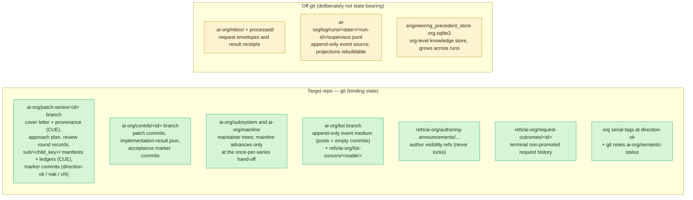

# AI Org — a Git-driven, Linux-community-shaped build engine

An engine that turns a raw natural-language request into reviewed, implemented, and merged
contributions on a target git repository. The pipeline is modeled on the Linux kernel
community process (patch series, review rounds, author reform, contribution branches, a
mailing list as the shared medium, subsystem/mainline maintainer boundaries). The engine
itself is deterministic Python; all judgment calls are delegated to a carrier LLM invoked
as a sandboxed subprocess with a JSON output schema. Durable planning bodies are CUE
canonical, emitted and validated by an in-process Go codec whose identity is
content-pinned and checked by a fail-closed handshake.

Documentation web: this README is the repo's face; the documentation hub lives at
[docs/README.md](docs/README.md) (rule: every md is referenced by another md; orphans are
forbidden).

## Topology

Every node below is implemented in this repository (module and function named in the
tables). Dashed nodes are stages the code *consults or documents but does not yet produce* —
they are drawn honestly as gaps, not features.

### Lifecycle pipeline

```mermaid
flowchart TD
    REQ["Requester: raw request<br/>(text or JSON, only raw_request required)"]

    subgraph intake_q["patchwork_queue — request to formed patch series"]
        SUBMIT["submit.submit<br/>write envelope to off-git inbox"]
        INBOX[["Off-git inbox<br/>.ai-org/inbox/&lt;id&gt;.json"]]
        PULL["pull<br/>one item per run: inbox, reform,<br/>review, then lineage work"]
        INTAKE["receive.intake<br/>validate: only raw_request required;<br/>mailing_list.ensure_list — the list branch<br/>exists from the first receive on"]
        GROUND["Grounding (carrier, read-only + web_search)<br/>research subject, prior art, repo context"]
        APPROACH["form technical approach<br/>consumes design facets by exact term list"]
        SENDBACK["needs_work / rejected<br/>processed inbox result +<br/>refs/ai-org/request-outcomes/&lt;id&gt;"]
        PROMOTE["PROMOTION — first git artifact<br/>branch ai-org/patch-series/&lt;id&gt;:<br/>patch-series-cover-letter.cue,<br/>patch-series-request-provenance.cue<br/>(CUE canonical via the body codec;<br/>the remaining JSON root plan is being<br/>converted by the producer-goal series)"]
    end

    EPS[("engineering_precedent_store<br/>org-level SQLite knowledge store")]

    subgraph review_q["review — direction debate (bounded rounds)"]
        REVIEW["review.run_patch_series_review<br/>5 axes: need, approach, compat,<br/>scope, maintenance (carrier each)"]
        AUF["Aufheben consolidation<br/>aggregate + dedupe objections,<br/>resolve reviewer contradictions"]
        ROUND["Durable round record committed:<br/>patch-series-review-rounds/<br/>round-NNNN-direction-review-record.json"]
        PORTS["Requester intervention ports<br/>PORT 1: annotate objection claim<br/>PORT 2: demote via resolution_authority"]
        REFORM["receive.reform_patch_series<br/>author reworks, commits patch_series vN+1<br/>+ author response + revision delta"]
        DOK["direction-ok marker commit<br/>+ org serial tag"]
        NAK["nak marker commit (terminal)"]
    end

    subgraph lineage["patch_series_gate — leaf network (right-sizing)"]
        REFINE["refine (carrier split)<br/>peer child nodes sub/&lt;child_key&gt;/<br/>manifest + coverage ledger + rollup<br/>(CUE canonical bodies)"]
        ELAB["elaborate / rebaseline / revalidate_stale<br/>rolling-wave child forming"]
    end

    subgraph author_q["patch_author — own-clone pull model (no lock)"]
        DISC["discovery.list_open<br/>ls-remote + committed artifacts only"]
        ANN["announcements.announce<br/>visibility ref, never a lock:<br/>refs/ai-org/authoring-announcements/..."]
        CW["code_worker.drive (default implementer)<br/>bounded per-item windows,<br/>one commit per plan item, declared checks;<br/>codex_reset: usage-limit waits survive<br/>instead of killing the run"]
        I2["implementer2 mode<br/>formal-frame-first: write frame.cue,<br/>harness runs cue vet + vacuity gate"]
        SUBP["submission.submit<br/>create-only push of contribution branch"]
    end

    CONTRIB["Contribution branch<br/>ai-org/contrib/&lt;id&gt;<br/>+ implementation-result.json"]

    MAKE["patch_authoring make —<br/>single-repo in-process path:<br/>implement.run then check, cap 3"]

    subgraph list_q["mailing_list — the shared medium (ai-org/list branch)"]
        LGEN["ensure_list<br/>genesis at the first receive:<br/>the list exists as if it always had"]
        QA["mailing_list_harvest.harvest_and_post_qa<br/>subscriber-side read of the recorded run:<br/>one kind=qa list post per item<br/>(checks + verbatim recorded self-narration);<br/>contributor commit machinery untouched"]
        LRFC["kind=rfc post at promotion —<br/>ruled, not yet wired"]
        LOFFER["kind=offer / kind=take posts —<br/>implementer2 as the first list-reading<br/>contributor; ruled, not yet wired"]
        LREAD["subsystem reads the list for review —<br/>ruled, not yet wired"]
    end

    subgraph accept_q["acceptance — independent judge (canonical side)"]
        FC["functional_check.check<br/>read-only worktree, carrier verdict:<br/>can a real user reach the goal?"]
        AMARK["marker commit on contrib branch:<br/>acceptance: reachable | blocked"]
    end

    subgraph seat_q["subsystem — the maintainer seat (two boundaries)"]
        ACC["subsystem.accept_leaf<br/>per-leaf: --no-ff into ai-org/subsystem,<br/>default branch fast-forwards<br/>(successors fork from accepted work);<br/>mainline is never touched here"]
        HAND["subsystem.handoff_series<br/>once per series, fail-closed while any<br/>leaf is unresolved; the mainline merge<br/>commit message IS the pull-request record"]
        MLB["ai-org/mainline<br/>always the last-accepted anchor:<br/>rejecting a series is resetting<br/>subsystem/default back to it"]
    end

    LEGACY["maintainer_merge (earlier integrator:<br/>carrier-verdict subsystem/mainline stages) —<br/>in tree, superseded by the subsystem seat;<br/>disposition pending"]

    IGATE["parent integration gate<br/>network: integration-gate marker —<br/>consumed by resolution rollup,<br/>never produced by any stage"]
    LINON["adversarial resolution review —<br/>named in docstring, not placed"]

    REQ --> SUBMIT --> INBOX --> PULL --> INTAKE
    INTAKE --> GROUND --> APPROACH --> PROMOTE
    GROUND -->|not confident / violations| SENDBACK
    GROUND -->|build design facets, sync| EPS
    EPS -->|lookup by same term list| APPROACH

    PROMOTE --> REVIEW --> AUF --> ROUND
    ROUND -->|objections pending| PORTS --> REFORM
    REFORM -->|vN+1 reposted| REVIEW
    ROUND -->|no unresolved objection| DOK
    ROUND -->|fundamentally unsuitable / cap verdict| NAK

    DOK -->|right-sized| DISC
    DOK --> MAKE --> CONTRIB
    DOK -->|oversized| REFINE --> ELAB --> DISC

    DISC --> ANN --> CW --> SUBP
    CW -->|--implementer implementer2| I2 --> SUBP
    SUBP --> CONTRIB
    CONTRIB --> QA

    INTAKE --> LGEN
    PROMOTE -.-> LRFC
    ELAB -.-> LOFFER
    LOFFER -.->|implementer2 subscribes| I2
    LREAD -.-> ACC

    CONTRIB --> FC --> AMARK
    AMARK -->|blocked: feedback| CW
    AMARK -->|reachable| ACC
    ACC -->|series network complete| HAND --> MLB

    ELAB -.->|all children resolved AND gate marker| IGATE
    ACC -.-> LEGACY
    HAND -.-> LINON

    classDef carrier fill:#e6e6fa,stroke:#66c,color:#213
    classDef gitstate fill:#d6f5d6,stroke:#2a7,color:#132
    classDef offgit fill:#fdf3d0,stroke:#b90,color:#321
    classDef hollow fill:none,stroke:#a33,stroke-dasharray:6 4,color:#a33
    class GROUND,APPROACH,REVIEW,AUF,REFORM,REFINE,CW,I2,FC,MAKE carrier
    class PROMOTE,ROUND,DOK,NAK,CONTRIB,AMARK,MLB,QA,LGEN gitstate
    class LRFC,LOFFER,LREAD hollow
    class INBOX,EPS,SENDBACK offgit
    class IGATE,LINON,LEGACY hollow
```

Purple nodes call the carrier; green nodes are committed git state; yellow nodes are the
deliberate off-git surfaces; red dashed nodes are honest gaps or superseded organs.

### The mailing list — the org's public square

The org adopts the LKML shape (precedent: lore.kernel.org stores a mailing list AS a git
repository via public-inbox). `ai_org/mailing_list.py` keeps an append-only branch
`ai-org/list` where one post = one empty commit whose message is the mail
(subject, body, `Kind:`/`Ref:` trailers), appended with compare-and-swap so concurrent
posters serialize. Per-reader cursors live at `refs/ai-org/list-cursors/<reader>`. The
list is created lazily at the first receive — any repository that has ever received a
request has the list as if it always existed. Boundary: the list is the event medium and
durable archive of what happened in order; it is never the decision source — canonical
bodies stay on series/contrib branches. First resident: the qa evidence harvest
(`ai_org/mailing_list_harvest.py`), which resolves each item commit to its recorded
carrier sessions through the `judge` provenance chain and posts checks + verbatim
recorded self-narration as `kind=qa` mail.

### The body codec — CUE canonical bodies

Durable planning bodies (cover letters, request provenance, coverage ledgers, node
manifests, status rollups, child approach trees) are CUE canonical: emitted, parsed, and
validated by `cuecodec/` (Go, `cuelang.org/go` in-process; module
`github.com/mishima-computing/cuecodec`) behind `ai_org/body_codec.py`. The codec's
identity is content-pinned (authority/catalog/manifest/public-contract SHA-256) and the
Python side verifies the pins in a fail-closed handshake — a changed codec input is
detected before any evaluation succeeds. JSON, where it still appears, is a disposable
projection; the root `technical-approach-plan.json` is the last JSON root, and the
producer-goal series converting it (together with the producer/referee goal pairing)
is in direction review now.

### Where state lives

Everything binding is committed on git branches/refs of the *target* repository. The
engine keeps no database of its own; logs are observability, never state.

```mermaid
flowchart LR
    subgraph git["Target repo — git (binding state)"]
        PS["ai-org/patch-series/&lt;id&gt; branch<br/>cover letter + provenance (CUE),<br/>approach plan, review round records,<br/>sub/&lt;child_key&gt;/ manifests + ledgers (CUE),<br/>marker commits (direction-ok / nak / vN)"]
        CB["ai-org/contrib/&lt;id&gt; branch<br/>patch commits, implementation-result.json,<br/>acceptance marker commits"]
        SSB2["ai-org/subsystem and ai-org/mainline<br/>maintainer trees; mainline advances only<br/>at the once-per-series hand-off"]
        LIST["ai-org/list branch<br/>append-only event medium (posts = empty commits)<br/>+ refs/ai-org/list-cursors/&lt;reader&gt;"]
        ANN2["refs/ai-org/authoring-announcements/...<br/>author visibility refs (never locks)"]
        OUT["refs/ai-org/request-outcomes/&lt;id&gt;<br/>terminal non-promoted request history"]
        TAGS["org serial tags at direction-ok<br/>+ git notes ai-org/semantic-status"]
    end

    subgraph offgit["Off-git (deliberately not state-bearing)"]
        IN2[".ai-org/inbox/ + processed/<br/>request envelopes and result receipts"]
        LOG[".ai-org/log/runs/&lt;date&gt;/&lt;run-id&gt;/supervisor.jsonl<br/>append-only event source; projections rebuildable"]
        EPS2["engineering_precedent_store org.sqlite3<br/>org-level knowledge store, grows across runs"]
    end

    classDef gitstate fill:#d6f5d6,stroke:#2a7,color:#132
    classDef offgit fill:#fdf3d0,stroke:#b90,color:#321
    class PS,CB,SSB2,LIST,ANN2,OUT,TAGS gitstate
    class IN2,LOG,EPS2 offgit
```

### The carrier boundary

The engine is deterministic Python: it owns branching, worktrees, sequencing, validation
gates, retry fingerprinting, and every commit. The carrier is an LLM CLI run as a
subprocess per judgment, constrained by a JSON `--output-schema` and a read-only (or
scoped workspace-write) sandbox, with fail-closed parsing of the result
(`ai_org/patchwork_queue/codex_exec.py`). Usage-limit interruptions are survived, not
fatal: `ai_org/codex_reset.py` parses the announced reset time and the spawn sites
wait-and-retry. Structure the model does not have to judge is generated by code
(`ai_org/deterministic_structure_gadgets/`), and schemas are built per use
(`ai_org/schema_lifecycle.py`).

### Provenance and forensics

`judge/` is a deterministic, read-only provenance tracer (no LLM): it joins any committed
body text to the field version, the run, the carrier call, the session, and the recorded
execution ("opinions are cheap; records are cited"). `carrier_revive/` resurrects a dead
carrier session from its recorded state. Both are library + CLI (`python -m judge`,
`python -m carrier_revive`), and the mailing-list harvest builds on the same resolver.

### Module map

| Area | Modules |
|---|---|
| Intake and review | `ai_org/patchwork_queue/` — `submit.py`, `receive.py`, `review.py`, `requester_assumptions.py`, `patch_series_gate.py`, `field_registry.py`, `spine.py`, `codex_exec.py` |
| Implementation (pull model) | `ai_org/patch_author/` — `discovery.py`, `announcements.py`, `work.py`, `code_worker.py` (default + implementer2 CUE-frame mode), `submission.py`, `contract.py` |
| Implementation (in-process) + acceptance | `ai_org/patch_authoring/` — `implement.py`, `functional_check.py` |
| Maintainer seat | `ai_org/subsystem.py` — `accept_leaf` (per-leaf, subsystem tree + default branch) and `handoff_series` (once per series, mainline); `ai_org/maintainer_merge/` is the earlier carrier-verdict integrator, superseded, disposition pending |
| Mailing list | `ai_org/mailing_list.py` (medium: post/read/cursors, genesis at receive), `ai_org/mailing_list_harvest.py` (kind=qa evidence posts) |
| Canonical bodies | `ai_org/body_codec.py` (pinned handshake client) + `cuecodec/` (Go codec, CUE schemas, goldens) |
| Provenance | `judge/` (deterministic tracing), `carrier_revive/` (session resurrection) |
| Shared windows | `ai_org/git_wrapper.py` (the single git gateway), `ai_org/engineering_precedent_store.py`, `ai_org/log.py`, `ai_org/codex_reset.py`, `ai_org/launch.py`, `ai_org/deterministic_structure_gadgets/`, `ai_org/schema_lifecycle.py` |
| Isolated tool | `ai_org/graphicist.py` (asset generation; not wired into the pipeline — enforced by `tests/test_architecture.py`) |

Each phase is pulled independently: `python -m ai_org.patchwork_queue.submit <repo> <request>`,
then `python -m ai_org.patchwork_queue`, and `python -m ai_org.patch_author <verb>` each
process one item per run. `python -m ai_org.launch` submits a request and detaches a pull
worker.

## History

- **Clean slate (2026-06-28).** The prior engine generations were judged a contaminated
  model and set aside so this engine could be designed and built clean from a fresh
  design conversation.
- **CUE-ification (completed 2026-07-13).** The engine migrated its own durable bodies to
  CUE canonical form by running its own pipeline on itself: an 11-leaf patch series
  (formation contracts, grounding boundary, semantic status, event stream, contributor
  handoff, implementation evidence, zero-gap closure, …), each leaf implemented by the
  formal-frame-first implementer, reviewed, and merged through the acceptance boundaries
  described above. The integrated result runs the full test suite green.
- **The maintainer seat and the mailing list (2026-07-13).** The two kernel boundaries —
  per-leaf application to the subsystem tree and the once-per-series hand-off to
  mainline — got their own deterministic organ, and the org adopted a git-native mailing
  list as its shared medium, starting with machine-posted qa evidence.
