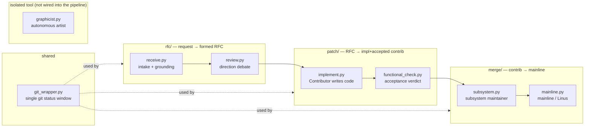

# ai_org module map — what each .py holds

Bird's-eye view of the package. Each module also has a top docstring; this is the index.
Boundaries are the 30-year Linux org abstraction: **rfc → patch → merge**, plus shared lens + an isolated tool.

## shared
| file | loc | holds |
|---|---|---|
| `__init__.py` | 18 | package marker; design note (Git / Linux-community model). |
| `git_wrapper.py` | 255 | the ONE sanctioned **git gateway/status window**. Git-derivable state comes from refs/topology; git-uncapturable semantic labels live in notes. Public includes branch/ref reads, merge-base/default/current branch helpers, branch file writes, semantic note read/write, and dependency graph derivation. |

## rfc/ — turn a raw request into a formed, contributor-takeable RFC
| file | loc | holds |
|---|---|---|
| `__init__.py` | 19 | rfc phase **pull** entry (re-exports `pull`). |
| `__main__.py` | 15 | `python -m ai_org.rfc` → `pull`. |
| `field_registry.py` | 273 | **research-derived RFC field registry**. Single source of truth for RFC handoff fields, per-field `role`/`belongs`/`must_not`/`owner`/`required_at`, JSON schema generation, and `tech_stack` validation. |
| `receive.py` | 4522 | **intake + grounding**. Public: `receive` (validate entrance: only `raw_request` required), `intake` (validate → `_ground_request` web-research/correct → `promoted` \| `needs_confirmation` \| `rejected`), `produce_rfc` (write grounded registry-shaped `rfc.json` to `ai-org/rfc/<id>`). Key helper: `_ground_request`. |
| `review.py` | 484 | **direction debate** of an already-formed RFC. Public: `run_rfc_review` (5 reviewers NEED/APPROACH/COMPAT/SCOPE/MAINTENANCE + Aufheben loop, CAP=5 → `direction-ok` \| `nak`). Helpers: `_review_one`, `_aufheben_consolidate`. |

## patch/ — produce an implemented AND accepted contribution branch
| file | loc | holds |
|---|---|---|
| `__init__.py` | 61 | Public: `make` (implement→acceptance loop, blockers fed back) + `pull` (take a direction-ok RFC with no contrib branch). |
| `__main__.py` | 15 | `python -m ai_org.patch` → `pull`. |
| `implement.py` | 261 | **Contributor implements** (codex workspace-write in a worktree → commits to `ai-org/contrib/<rfc-id>`). Public: `run`. |
| `functional_check.py` | 263 | **acceptance** (read-only worktree → codex verdict reachable/blocked, committed on the branch). Public: `check`. |

## merge/ — integrate up to mainline
| file | loc | holds |
|---|---|---|
| `__init__.py` | 52 | Public: `pull` (accepted contrib → subsystem; subsystem → mainline). |
| `__main__.py` | 15 | `python -m ai_org.merge` → `pull`. |
| `subsystem.py` | 244 | **subsystem maintainer**: git-read → codex judgment → real `git merge --no-ff` in a throwaway worktree (conflict → worktree discarded). Public: `review_and_integrate`. |
| `mainline.py` | 253 | **mainline / Linus** stage, same shape. Public: `review_and_integrate`. |

## isolated tool (NOT wired into rfc/patch/merge; architecture test asserts the boundary)
| file | loc | holds |
|---|---|---|
| `graphicist.py` | 1203 | **autonomous artist / asset tool**. Public: `autonomous_create` (request-only → web-research ART BRIEF → generate → qa → self-critique → optional animate), `constructive_svg` (form-by-construction SVG; styles painterly/cute; views incl side; face canon; segmentation), `animate` (JS rig: rig.json keyframes + FK runtime + preview.html), `fetch_web_image` (Openverse/Wikimedia CC, no key), `render_svg` (headless Chrome), `qa` (model-free PNG checks), `image_model` (raster-model slot, not provisioned). |

## Each module's runnable entry
- `python -m ai_org.rfc` / `ai_org.patch` / `ai_org.merge` — each role **pulls** its own next item from git (no central orchestrator).
- `tests/test_architecture.py` enforces: acyclic imports, no module imports all 3 phases, graphicist isolated.
