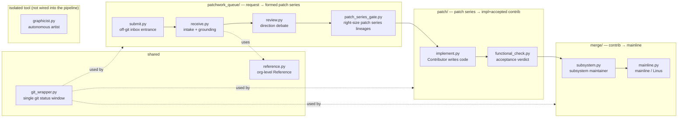

# ai_org module map — what each .py holds

Bird's-eye view of the package. Each module also has a top docstring; this is the index.
Boundaries are the 30-year Linux org abstraction: **patchwork_queue → patch → merge**, plus shared lens + an isolated tool.

```mermaid
flowchart LR
  subgraph shared["shared"]
    GW["git_wrapper.py<br/>single git status window"]
    REF["reference.py<br/>org-level Reference"]
  end
  subgraph patchwork_queue["patchwork_queue/ — request → formed patch series"]
    RSUB["submit.py<br/>off-git inbox entrance"]
    RREC["receive.py<br/>intake + grounding"]
    RREV["review.py<br/>direction debate"]
    RLIN["patch_series_gate.py<br/>right-size patch series lineages"]
  end
  subgraph patch["patch/ — patch series → impl+accepted contrib"]
    PIMP["implement.py<br/>Contributor writes code"]
    PACC["functional_check.py<br/>acceptance verdict"]
  end
  subgraph merge["merge/ — contrib → mainline"]
    MSUB["subsystem.py<br/>subsystem maintainer"]
    MMAIN["mainline.py<br/>mainline / Linus"]
  end
  subgraph tool["isolated tool (not wired into the pipeline)"]
    GRAPH["graphicist.py<br/>autonomous artist"]
  end

  RSUB --> RREC --> RREV --> RLIN --> PIMP --> PACC --> MSUB --> MMAIN
  RREC -.uses.-> REF
  GW -.used by.-> patchwork_queue & patch & merge
```

## shared
| file | loc | holds |
|---|---|---|
| `__init__.py` | 18 | package marker; design note (Git / Linux-community model). |
| `git_wrapper.py` | 255 | the ONE sanctioned **git gateway/status window**. Git-derivable state comes from refs/topology; git-uncapturable semantic labels live in notes. Public includes branch/ref reads, merge-base/default/current branch helpers, machine-oriented changed-path reads, branch file writes, semantic note read/write, and dependency graph derivation. |
| `reference.py` | 2983 | org-level **Reference** store and lookup lens. Builds design/implementation facets from patch series concepts, persists append-only SQLite/WAL knowledge, supports bounded background research, and provides lookup/expansion used by patch series receive and later patch work. |

## patchwork_queue/ — turn a raw request into a formed, contributor-takeable patch series
| file | loc | holds |
|---|---|---|
| `__init__.py` | 251 | patch-series phase **pull** entry: process one off-git inbox request, author reform, review, network split, or requested-child elaboration; exposes `refine`. |
| `__main__.py` | 15 | `python -m ai_org.patchwork_queue` → `pull`. |
| `submit.py` | 145 | requester-facing entrance. Public: `submit` and `python -m ai_org.patchwork_queue.submit <repo> <request>`; parses JSON file, JSON object string, or plain text; writes `<repo>/.ai-org/inbox/<id>.json` or `AI_ORG_INBOX`; prints id + path; appends `.ai-org/` to `.gitignore` when needed without committing. |
| `field_registry.py` | 273 | **research-derived patch series field registry**. Single source of truth for patch series handoff fields, per-field `role`/`belongs`/`must_not`/`owner`/`required_at`, JSON schema generation, and `tech_stack` validation. |
| `patch_series_gate.py` | 2300+ | active Reference-informed patch series LINEAGE machinery. Public: `refine` (split a direction-ok oversized technical approach into peer `sub/<child_key>/` patch series nodes with `patch-series-manifest.json` authority and generated `network-status-rollup.json`), `stamp_children`, `validate_lineage_gate`, `migrate_legacy_tree_to_edges`, `generate_mermaid_projection`, `readiness_rollup`, `topological_order`, `critical_path`, `validate_child_write_scope`, `validate_spine_ancestry`, `right_sized`, `resolved`, `escalate`, `mark_stale`, `elaborate`, plus pull predicates for split/requested-node readiness. Uses safe-subset structured-output schemas, single-source declared dependency edges, deterministic 100% scope coverage validation, total state predicates, state-event projection, and rolling-wave elaboration. |
| `receive.py` | 5192 | **intake + grounding**. Public: `receive` (validate entrance: only `raw_request` required), `intake` (validate → `_ground_request` web-research/correct → `promoted` \| `needs_work` \| `needs_confirmation` \| `rejected`), `produce_rfc` (write grounded registry-shaped `patch-series-cover-letter.json` and `technical-approach-plan.json` to `ai-org/patch-series/<id>` only after promotion). Key helper: `_ground_request`. |
| `review.py` | 484 | **direction debate** of an already-formed patch series. Public: `run_rfc_review` (5 reviewers NEED/APPROACH/COMPAT/SCOPE/MAINTENANCE + Aufheben loop, CAP=5 → `direction-ok` \| `nak`). Helpers: `_review_one`, `_aufheben_consolidate`. |

## patch/ — produce an implemented AND accepted contribution branch
| file | loc | holds |
|---|---|---|
| `__init__.py` | 61 | Public: `make` (implement→acceptance loop, blockers fed back) + `pull` (take a direction-ok patch series with no contrib branch). |
| `__main__.py` | 15 | `python -m ai_org.patch` → `pull`. |
| `implement.py` | 261 | **Contributor implements** (codex workspace-write in a worktree → commits to `ai-org/contrib/<patch-series-id>`). Public: `run`. |
| `functional_check.py` | 263 | **acceptance** (read-only worktree → codex verdict reachable/blocked, committed on the branch). Public: `check`. |

## merge/ — integrate up to mainline
| file | loc | holds |
|---|---|---|
| `__init__.py` | 52 | Public: `pull` (accepted contrib → subsystem; subsystem → mainline). |
| `__main__.py` | 15 | `python -m ai_org.merge` → `pull`. |
| `subsystem.py` | 244 | **subsystem maintainer**: git-read → codex judgment → real `git merge --no-ff` in a throwaway worktree (conflict → worktree discarded). Public: `review_and_integrate`. |
| `mainline.py` | 253 | **mainline / Linus** stage, same shape. Public: `review_and_integrate`. |

## isolated tool (NOT wired into patchwork_queue/patch/merge; architecture test asserts the boundary)
| file | loc | holds |
|---|---|---|
| `graphicist.py` | 1203 | **autonomous artist / asset tool**. Public: `autonomous_create` (request-only → web-research ART BRIEF → generate → qa → self-critique → optional animate), `constructive_svg` (form-by-construction SVG; styles painterly/cute; views incl side; face canon; segmentation), `animate` (JS rig: rig.json keyframes + FK runtime + preview.html), `fetch_web_image` (Openverse/Wikimedia CC, no key), `render_svg` (headless Chrome), `qa` (model-free PNG checks), `image_model` (raster-model slot, not provisioned). |

## Each module's runnable entry
- `python -m ai_org.patchwork_queue.submit <repo> <request>` — requester writes one raw request to the off-git inbox and receives an id/path receipt.
- `python -m ai_org.patchwork_queue` / `ai_org.patch` / `ai_org.merge` — each role **pulls** its own next item (patch series first checks the off-git inbox, then git patch series branches; patch/merge pull from git).
- `tests/test_architecture.py` enforces: acyclic imports, no module imports all 3 phases, graphicist isolated.
