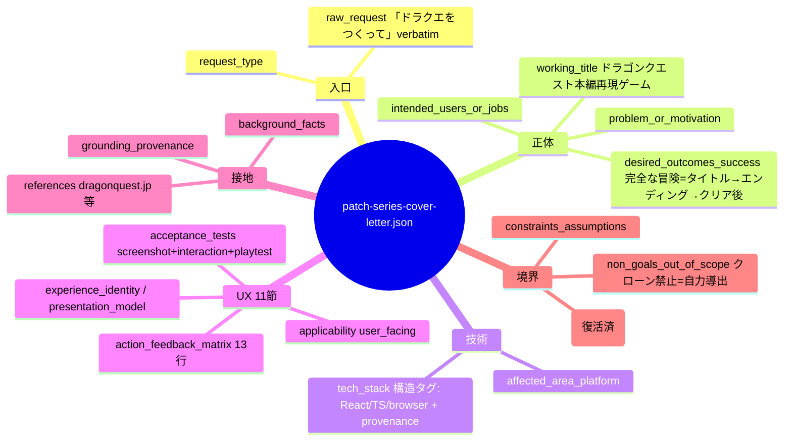
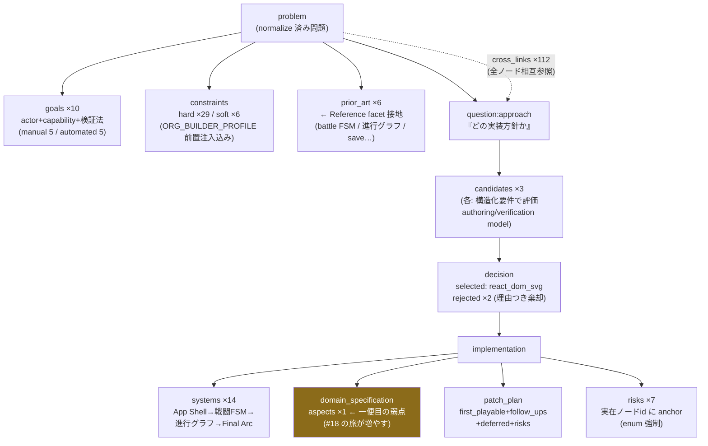

# patch series の解剖図 — promoted DQ patch series（run14 実物）の JSON 構造

「ドラクエをつくって」一行から org が生成した実物の構造。数字は全て run14 の実測。

## 全体像 — patch series branch に載る一式

```mermaid
flowchart LR
    REQ["📨 依頼<br/>『ドラクエをつくって』<br/>(off-git inbox)"] --> BRANCH

    subgraph BRANCH["patch series branch (git が正本)"]
        patch series["patch-series-cover-letter.json<br/>17 fields · 22KB<br/><i>何を作るかの契約</i>"]
        TA["technical-approach-plan.json<br/>288KB<br/><i>どう作るかの導出木</i>"]
        DS["domain-spec/*.json<br/><i>ドメイン数値の器</i>"]
        SP["spine/ (新設)<br/>art-bible.json<br/>asset-manifest.schema.json<br/><i>子が相続する凍結契約</i>"]
        LN["patch-series-manifest.json<br/><i>節の権威 manifest</i>"]
    end

    patch series -.->|"手引き"| TA
    TA -.->|"数値の置き場"| DS
    style patch series fill:#1a4b6b,color:#fff
    style TA fill:#4b1a6b,color:#fff
    style SP fill:#6b4b1a,color:#fff
```

## patch-series-cover-letter.json — 17 フィールド（field registry 統治）



## technical-approach-plan.json — 導出木（IBIS/Toulmin 接地）



## 読み方の要点

- **patch-series-cover-letter.json は requester との契約**、technical-approach は **org 内の導出記録**——別ファイルなのは
  「契約の安定」と「改版の分離」のため（親の外形 request と子の内側、と同じ分離原理）。
- **cross_links ×112** が導出の監査可能性の実体——どの決定がどの goal/constraint から
  導かれたかを機械が辿れる。
- 黄色いノード（aspects ×1）が一便目の弱点だった場所——#18 の旅が combat formula や
  content budget をここに増築する設計（門番研修中）。
