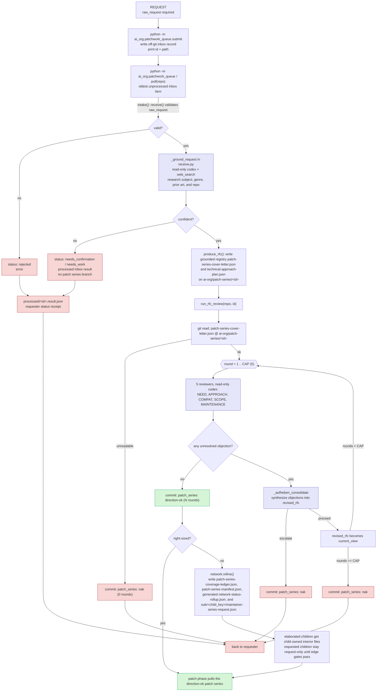

# patch series phase current flow

The patch series phase has four isolated responsibilities:

- `submit.py` is the requester-facing entrance. It writes raw requests to the off-git inbox at `<repo>/.ai-org/inbox` or `AI_ORG_INBOX` and prints a receipt.
- `receive.py` accepts a raw request with only `raw_request` required, grounds it into the research-derived patch series field registry, or sends it back with a proposed interpretation and assumptions to confirm or correct.
- `review.py` debates the direction of an already-formed `patch-series-cover-letter.json` and commits `direction-ok` or `nak`.
- `patch_series_gate.py` splits direction-ok oversized Technical Approaches into peer patch series-shaped nodes under `sub/<child_key>/` on the same patch series branch. `patch-series-manifest.json` is the node-local authority; `network-status-rollup.json` is a generated roll-up.

## Notes

- `python -m ai_org.patchwork_queue.submit <repo> <request>` is the public requester entrance. `<request>` may be a JSON file path, a JSON object string, or plain text. Plain text becomes `{"raw_request": <text>}`.
- `submit.py` creates `<repo>/.ai-org/inbox/` by default and appends `.ai-org/` to the target repo's `.gitignore` when the entry is absent. It does not commit or stage the `.gitignore` change. If `AI_ORG_INBOX` is set, that external inbox path is used instead.
- `pull(repo)` processes one unprocessed inbox file before it scans `ai-org/patch-series/*` branches for review. If the inbox is empty, pull behaves as before.
- After the existing pull order (inbox intake, author-pending reform, reviewable patch series), `pull(repo)` takes one network item: first a direction-ok serialed patch series that is not right-sized and has no generated status, then a requested peer child whose dependency edges are satisfied.
- `intake(request, repo)` remains the receive gate for raw requests. It returns `status: promoted`, `status: needs_work`, `status: needs_confirmation`, or `status: rejected`.
- Grounding belongs to intake because it forms the patch series. It may correct a wrong request, such as a mistaken genre reference, before a branch exists.
- A promoted request is the first git artifact: `ai-org/patch-series/<id>` with `patch-series-cover-letter.json` and `technical-approach-plan.json`. Needs-work and rejected requests do not create git branches; their status is written to `.ai-org/inbox/processed/<id>.result.json`.
- The patch series handoff shape is the in-code field registry: `raw_request`, `working_title`, `request_type`, `problem_or_motivation`, `intended_users_or_jobs`, `desired_outcomes_success`, `affected_area_platform`, `tech_stack`, `background_facts`, `constraints_assumptions`, `references`, `grounding_provenance`, `open_questions`, `non_goals_out_of_scope`, `proposal_hint`, and `alternatives_considered`.
- Each registry field carries `role`, `belongs`, `must_not`, `owner`, and `required_at`. The `must_not` text is the anti-dumping gate: research audit trail belongs in `grounding_provenance`, bounded domain facts belong in `background_facts`, external pointers belong in `references`, and `context` is no longer a patch series intake field.
- If grounding cannot confidently identify the intended subject or scope, intake still returns its best grounded guess as `proposed_rfc`, lists the `assumptions` behind that guess, and asks the requester to confirm or correct it. `questions` are only for gaps that research genuinely could not infer.
- `review.py` assumes `patch-series-cover-letter.json` is already grounded. It only runs the five-reviewer and Aufheben direction debate.
- `patch_series_gate.py` assumes `technical-approach-plan.json` is approved. It maps the approved `patch_plan`, implementation systems, UX acceptance tests, success criteria, and must-address risks onto children; it does not re-derive a split from patch series prose.
- Child forming identity is the peer node path, for example `ai-org/patch-series/0042:sub/battle`. Child serial sub-numbers are assigned later at the direction/acceptance boundary that needs them; there is no change-id registry.
- A split writes `patch-series-coverage-ledger.json` and root `patch-series-manifest.json` on the parent branch, plus `sub/<child_key>/patch-series-manifest.json` for each child. The ledger enumerates parent scope items, maps each item to exactly one child node or `parent:integration-gate`, and projects dependency rows from declared `edges`.
- The parent writes each child's `maintainer-series-request.json` as the same envelope shape used by `submit.py`; the child owns interior files (`patch-series-cover-letter.json`, `technical-approach-plan.json`, and `domain-spec/`) once elaborated. `network-status-rollup.json` is generated from manifests and never hand-edited.
- Child implementation branches are still allowed, but child patch series document branches such as `ai-org/patch-series/0042-1` are not created by network. Write-scope and spine-ancestry gates check child work before acceptance.
- Resolution rolls up: a child is resolved when its contribution is accepted and merged; a parent is resolved when all required dependency closure is satisfied and the parent has an integration-gate marker.
- Codex output schemas remain codex-valid: no `allOf`, `anyOf`, or `oneOf`; `additionalProperties` is false; `required` lists every property.
