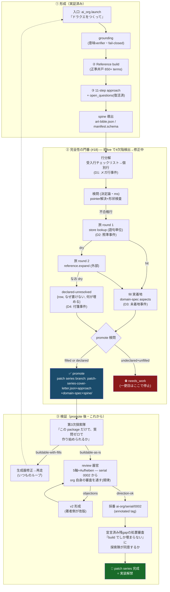

# patch series Verification Flow — 「ドラクエをつくって」正式便の検証計画

patch series は promote で「できた」ことにならない。**書くことで埋まる穴が尽き（buildable-as-is）、
審査を通り、採番されて**初めて完成であり、実装解禁はその後（requester 規律 2026-07-03）。

## 検証の合格基準（批准済み）

| 段 | 判定者 | 基準 |
|---|---|---|
| 検問 | 決定論 (harness) | 全行 filled or declared |
| 探索隊 | 敵対的 codex (unled) | 「書くことで答えられた質問」がゼロ |
| review | org の審査器官 | direction-ok（serial 0002 から必須経路） |
| 残gap処置 | 探索隊+review | 宣言の正当性（build でしか埋まらぬこと）に同意 |

一便目の実績: 形成◎ / 門番=正しく拒否したが4欠陥（修正wave 走行中）/ 検証=未到達。
