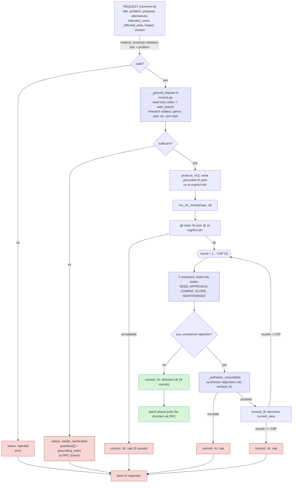

# RFC phase current flow

The RFC phase has two isolated responsibilities:

- `receive.py` turns a raw common-8 request into a grounded RFC branch, or sends it back with clarification questions.
- `review.py` debates the direction of an already-formed `rfc.json` and commits `direction-ok` or `nak`.

## Notes

- `intake(request, repo)` is the public entrance for raw requests. It returns `status: promoted`, `status: needs_clarification`, or `status: rejected`.
- Grounding belongs to intake because it forms the RFC. It may correct a wrong request, such as a mistaken genre reference, before a branch exists.
- If grounding cannot confidently identify the intended subject or scope, intake returns specific requester questions and does not create `ai-org/rfc/<id>`.
- `review.py` assumes `rfc.json` is already grounded. It only runs the five-reviewer and Aufheben direction debate.
- Codex output schemas remain codex-valid: no `allOf`, `anyOf`, or `oneOf`; `additionalProperties` is false; `required` lists every property.
