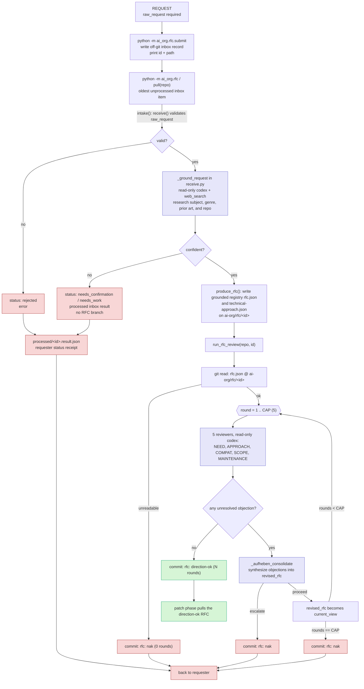

# RFC phase current flow

The RFC phase has three isolated responsibilities:

- `submit.py` is the requester-facing entrance. It writes raw requests to the off-git inbox at `<repo>/.ai-org/inbox` or `AI_ORG_INBOX` and prints a receipt.
- `receive.py` accepts a raw request with only `raw_request` required, grounds it into the research-derived RFC field registry, or sends it back with a proposed interpretation and assumptions to confirm or correct.
- `review.py` debates the direction of an already-formed `rfc.json` and commits `direction-ok` or `nak`.

## Notes

- `python -m ai_org.rfc.submit <repo> <request>` is the public requester entrance. `<request>` may be a JSON file path, a JSON object string, or plain text. Plain text becomes `{"raw_request": <text>}`.
- `submit.py` creates `<repo>/.ai-org/inbox/` by default and appends `.ai-org/` to the target repo's `.gitignore` when the entry is absent. It does not commit or stage the `.gitignore` change. If `AI_ORG_INBOX` is set, that external inbox path is used instead.
- `pull(repo)` processes one unprocessed inbox file before it scans `ai-org/rfc/*` branches for review. If the inbox is empty, pull behaves as before.
- `intake(request, repo)` remains the receive gate for raw requests. It returns `status: promoted`, `status: needs_work`, `status: needs_confirmation`, or `status: rejected`.
- Grounding belongs to intake because it forms the RFC. It may correct a wrong request, such as a mistaken genre reference, before a branch exists.
- A promoted request is the first git artifact: `ai-org/rfc/<id>` with `rfc.json` and `technical-approach.json`. Needs-work and rejected requests do not create git branches; their status is written to `.ai-org/inbox/processed/<id>.result.json`.
- The RFC handoff shape is the in-code field registry: `raw_request`, `working_title`, `request_type`, `problem_or_motivation`, `intended_users_or_jobs`, `desired_outcomes_success`, `affected_area_platform`, `tech_stack`, `background_facts`, `constraints_assumptions`, `references`, `grounding_provenance`, `open_questions`, `non_goals_out_of_scope`, `proposal_hint`, and `alternatives_considered`.
- Each registry field carries `role`, `belongs`, `must_not`, `owner`, and `required_at`. The `must_not` text is the anti-dumping gate: research audit trail belongs in `grounding_provenance`, bounded domain facts belong in `background_facts`, external pointers belong in `references`, and `context` is no longer an RFC intake field.
- If grounding cannot confidently identify the intended subject or scope, intake still returns its best grounded guess as `proposed_rfc`, lists the `assumptions` behind that guess, and asks the requester to confirm or correct it. `questions` are only for gaps that research genuinely could not infer.
- `review.py` assumes `rfc.json` is already grounded. It only runs the five-reviewer and Aufheben direction debate.
- Codex output schemas remain codex-valid: no `allOf`, `anyOf`, or `oneOf`; `additionalProperties` is false; `required` lists every property.
